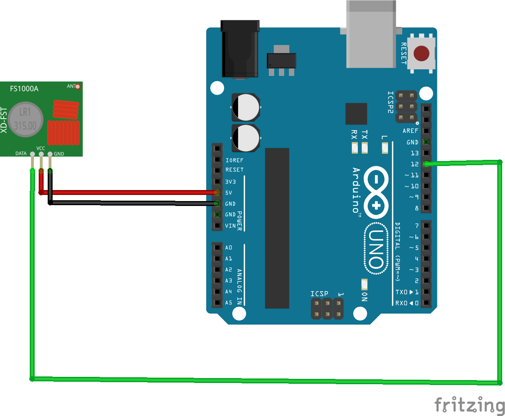
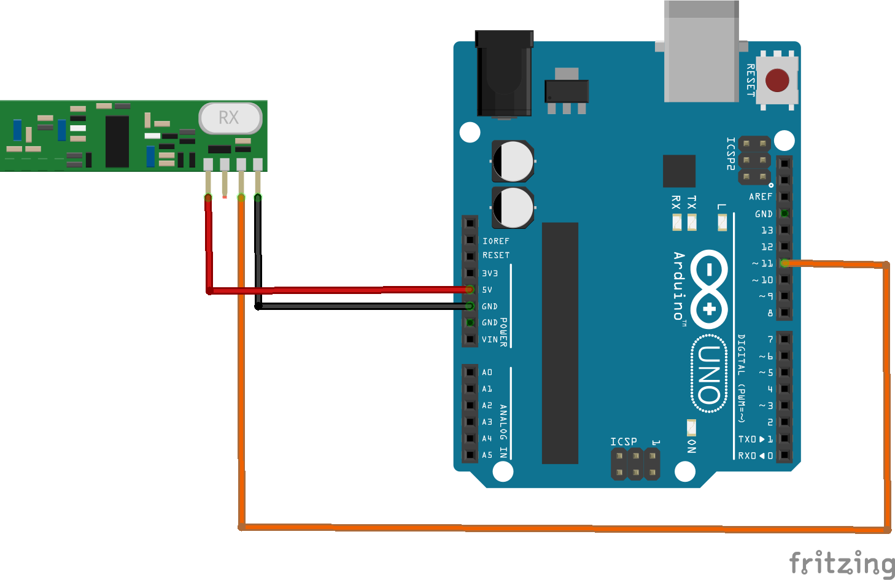

# Transmisión a 400mhz - Esquema de conexiones

## Resumen

En este apartado se recogen las conexiones necesarias para la correcta utilización del transmisor y el receptor RF.

## Autoría y Licencia

- Autor: **Goyo Regalado Pacheco** ( goyoregalado@gmail.com )
- Fecha: **29/10/2015**
- Versión: **1.0.0**
- Licencia: 

## Esquemas de conexiones

### Transmisor RF

### Receptor RF

